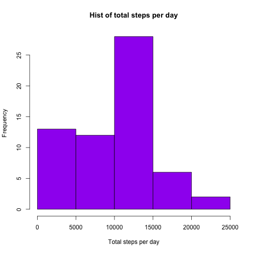
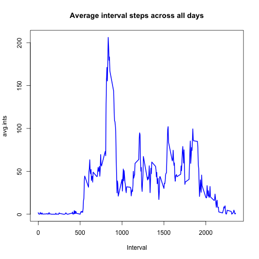

# Reproducible Research: Peer Assessment 1


## Loading and preprocessing the data


```r
setwd("/Users/rodolfofernandez/Desktop/RepData_PeerAssessment1")
act.data <- read.csv("activity.csv")
names(act.data)
```

```
## [1] "steps"    "date"     "interval"
```

```r
head(act.data)
```

```
##   steps       date interval
## 1    NA 2012-10-01        0
## 2    NA 2012-10-01        5
## 3    NA 2012-10-01       10
## 4    NA 2012-10-01       15
## 5    NA 2012-10-01       20
## 6    NA 2012-10-01       25
```

```r
summary(act.data)
```

```
##      steps               date          interval   
##  Min.   :  0.0   2012-10-01:  288   Min.   :   0  
##  1st Qu.:  0.0   2012-10-02:  288   1st Qu.: 589  
##  Median :  0.0   2012-10-03:  288   Median :1178  
##  Mean   : 37.4   2012-10-04:  288   Mean   :1178  
##  3rd Qu.: 12.0   2012-10-05:  288   3rd Qu.:1766  
##  Max.   :806.0   2012-10-06:  288   Max.   :2355  
##  NA's   :2304    (Other)   :15840
```

```r
# process dates
library(lubridate)
act.data$date <- ymd(act.data$date)
```

## What is mean total number of steps taken per day?

```r
hist(tapply(act.data$steps, act.data$date, sum, na.rm = T), col = "purple", 
    xlab = "Total steps per day", main = "Hist of total steps per day")
```

 

```r
mean(tapply(act.data$steps, act.data$date, sum, na.rm = T), na.rm = T)
```

```
## [1] 9354
```

```r
median(tapply(act.data$steps, act.data$date, sum, na.rm = T), na.rm = T)
```

```
## [1] 10395
```

## What is the average daily activity pattern?

```r
avg.ints <- tapply(act.data$steps, act.data$interval, mean, na.rm = T)
plot(as.numeric(rownames(avg.ints)), avg.ints, type = "l", lwd = 2, col = "blue", 
    main = "Average interval steps across all days", xlab = "Interval")
```

 

##Which 5-minute interval, on average across all the days in the dataset, contains the maximum number of steps?

```r
names(avg.ints[which.max(avg.ints)])
```

```
## [1] "835"
```

## Imputing missing values


## Are there differences in activity patterns between weekdays and weekends?
