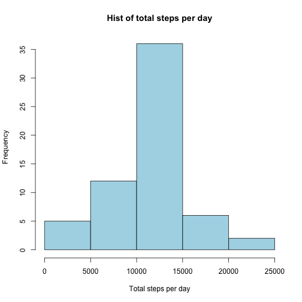

# Reproducible Research: Peer Assessment 1


## Loading and preprocessing the data


```r
setwd("/Users/rodolfofernandez/Desktop/RepData_PeerAssessment1")
act.data <- read.csv("activity.csv")
names(act.data)
```

```
## [1] "steps"    "date"     "interval"
```

```r
head(act.data)
```

```
##   steps       date interval
## 1    NA 2012-10-01        0
## 2    NA 2012-10-01        5
## 3    NA 2012-10-01       10
## 4    NA 2012-10-01       15
## 5    NA 2012-10-01       20
## 6    NA 2012-10-01       25
```

```r
summary(act.data)
```

```
##      steps               date          interval   
##  Min.   :  0.0   2012-10-01:  288   Min.   :   0  
##  1st Qu.:  0.0   2012-10-02:  288   1st Qu.: 589  
##  Median :  0.0   2012-10-03:  288   Median :1178  
##  Mean   : 37.4   2012-10-04:  288   Mean   :1178  
##  3rd Qu.: 12.0   2012-10-05:  288   3rd Qu.:1766  
##  Max.   :806.0   2012-10-06:  288   Max.   :2355  
##  NA's   :2304    (Other)   :15840
```

```r
# process dates
library(lubridate)
act.data$date <- ymd(act.data$date)
```

## What is mean total number of steps taken per day?

```r
hist(tapply(act.data$steps, act.data$date, sum, na.rm = T), col = "purple", 
    xlab = "Total steps per day", main = "Hist of total steps per day")
```

 

```r
mean(tapply(act.data$steps, act.data$date, sum, na.rm = T), na.rm = T)
```

```
## [1] 9354
```

```r
median(tapply(act.data$steps, act.data$date, sum, na.rm = T), na.rm = T)
```

```
## [1] 10395
```

## What is the average daily activity pattern?

```r
avg.ints <- tapply(act.data$steps, act.data$interval, mean, na.rm = T)
plot(as.numeric(rownames(avg.ints)), avg.ints, type = "l", lwd = 2, col = "blue", 
    main = "Average interval steps across all days", xlab = "Interval")
```

 

## Which 5-minute interval, on average across all the days in the dataset, contains the maximum number of steps?

```r
names(avg.ints[which.max(avg.ints)])
```

```
## [1] "835"
```

## Imputing missing values

1. Calculate and report the total number of missing values in the dataset (i.e. the total number of rows with NAs)

```r
length(which(is.na(act.data$steps == T) | is.na(act.data$date == T) | is.na(act.data$interval == 
    T)))
```

```
## [1] 2304
```

2. Devise a strategy for filling in all of the missing values in the dataset. The strategy does not need to be sophisticated. For example, you could use the mean/median for that day, or the mean for that 5-minute interval, etc.
    The substitution that will be used to fill up all the NA's will be the average of the interval to which the NA belongs to (not rounded). It will be done along with the next point:
3. Create a new dataset that is equal to the original dataset but with the missing data filled in.

```r
new.frame <- act.data
for (i in 1:length(act.data$steps)) {
    if (is.na(new.frame[i, 1]) == T) {
        new.frame[i, 1] <- avg.ints[as.character(new.frame[i, 3])]
    }
}
head(new.frame)
```

```
##     steps       date interval
## 1 1.71698 2012-10-01        0
## 2 0.33962 2012-10-01        5
## 3 0.13208 2012-10-01       10
## 4 0.15094 2012-10-01       15
## 5 0.07547 2012-10-01       20
## 6 2.09434 2012-10-01       25
```


4. Make a histogram of the total number of steps taken each day and Calculate and report the mean and median total number of steps taken per day. Do these values differ from the estimates from the first part of the assignment? What is the impact of imputing missing data on the estimates of the total daily number of steps?


```r
hist(tapply(new.frame$steps, new.frame$date, sum, na.rm = T), col = "light blue", 
    xlab = "Total steps per day", main = "Hist of total steps per day")
```

 

```r
mean(tapply(new.frame$steps, new.frame$date, sum, na.rm = T), na.rm = T)
```

```
## [1] 10766
```

```r
median(tapply(new.frame$steps, new.frame$date, sum, na.rm = T), na.rm = T)
```

```
## [1] 10766
```


## Are there differences in activity patterns between weekdays and weekends?
